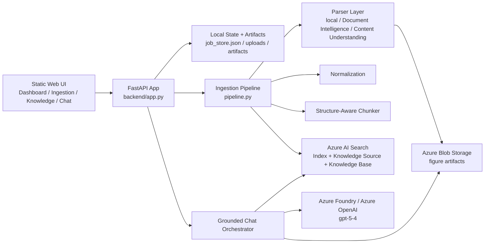
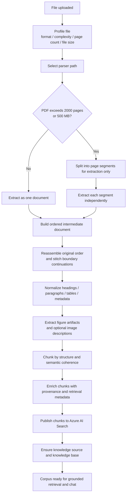
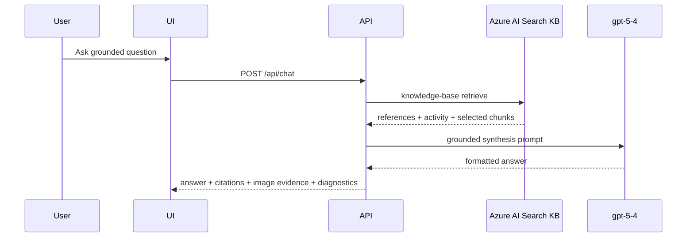

# Enterprise Knowledge Ingestion

Production-minded FastAPI application for enterprise document ingestion, large-file breakdown, structure-aware chunking, Azure AI Search knowledge publishing, and grounded chat with `gpt-5.4`.

The core design rule is simple: **the file is not the indexed unit**. A document first goes through profiling, parser selection, optional extractor-side segmentation, document reassembly, normalization, figure extraction, and structure-aware chunking. Only the resulting retrieval-ready chunks are published to Search.

## What The App Does

- Uploads local documents through a web UI.
- Profiles each file before parsing by inspecting type, size, page count, and rough complexity.
- Routes the file to the appropriate parser path.
- Splits oversized PDFs before Azure Document Intelligence analysis when page-count or file-size limits are exceeded.
- Reassembles extracted segment outputs into one logical document view.
- Preserves sections, page ranges, tables, figures, and metadata in an intermediate JSON model.
- Extracts embedded PDF figures and can describe them with `gpt-5.4`.
- Stores figure artifacts locally and attempts Blob upload when configured.
- Chunks content by structure instead of flattening whole documents.
- Publishes chunks into Azure AI Search index, knowledge source, and knowledge base.
- Uses Azure AI Search knowledge-base retrieval as the grounded retrieval layer.
- Uses deployed `gpt-5.4` to synthesize final answers from retrieved evidence.
- Shows citations, image evidence, and agentic retrieval activity in the chat UI.

## Current Architecture



## Main Components

### Frontend

- `frontend/static/index.html`
- `frontend/static/app.js`
- `frontend/static/styles.css`

The UI includes:

- Dashboard
- Ingestion screen with sample generators
- Knowledge-base status
- Chat screen with user and agent bubbles
- Citation cards
- Image evidence cards
- Agentic retrieval activity panel
- Debug toggle

### Backend

- `backend/app.py`

Exposes upload, sample generation, status, retry, sync, chat, and figure artifact endpoints.

### Ingestion pipeline

- `backend/services/pipeline.py`

Pipeline responsibilities:

- profile the document
- choose the parser path
- decide whether extractor-side segmentation is required
- parse one file or many segments
- rebuild a unified intermediate document
- normalize and preserve figures
- create retrieval chunks
- enrich metadata
- persist artifacts
- publish to Search
- mark document ready for chat

### Parser selection and split logic

- `backend/services/parsers.py`
- `backend/core/config.py`

This is where the current selection logic lives.

The important distinction is:

- **parsing boundary**: a temporary extraction batch used to stay inside service limits
- **indexing boundary**: the final chunk emitted after the document has been reassembled and normalized

The parser layer is responsible for the first boundary. The chunker is responsible for the second one.

The active split rule is:

```text
if file is PDF and (
    page_count > HARD_PAGE_SPLIT_THRESHOLD
    or file_size > HARD_FILE_SPLIT_THRESHOLD_MB
):
    split into page-based segments
```

Current default thresholds:

- `HARD_PAGE_SPLIT_THRESHOLD=2000`
- `HARD_FILE_SPLIT_THRESHOLD_MB=500`
- `MAX_PAGES_PER_SEGMENT=250`

Current parser-routing intent:

- simple digital text documents -> local text-oriented parsing
- structure-heavy PDFs -> Azure Document Intelligence
- scanned or image-heavy documents -> OCR or layout-aware extraction
- Content Understanding -> optional alternate parser when configured
- oversized PDFs -> page-based extraction segments before Document Intelligence analysis

Notes:

- split decisions are made in `AzureDocumentIntelligenceParser.parse(...)`
- parser warnings are created in `ParserSelection.profile(...)`
- the pipeline calls parser detection and parse execution, but does not define the split rules itself

### Chunking

- `backend/services/chunking.py`

The chunker is structure-aware. It keeps:

- section path
- page numbers
- source metadata
- checksum
- tags
- chunk text

### Search publishing

- `backend/services/indexing.py`

The publishing adapter creates or updates:

- Azure AI Search index
- knowledge source
- knowledge base

and uploads chunk records with merge-or-upload semantics.

### Grounded chat

- `backend/services/chat.py`
- `backend/services/foundry_openai.py`

The current chat path is:

1. retrieve grounded references from Azure AI Search knowledge base
2. hydrate citations and figure evidence
3. send grounded evidence pack to deployed `gpt-5.4`
4. render answer, citations, image evidence, and retrieval diagnostics in the UI

## Ingestion To Indexing Journey

This app treats document processing as a retrieval-quality pipeline, not as a raw file-upload step.

There are three separate layers in the journey:

1. **Extraction layer**: get content out of the source file, even if the file must be split into temporary batches first.
2. **Document layer**: rebuild one coherent document view with stable ordering, headings, figures, and metadata.
3. **Retrieval layer**: create retrieval-friendly chunks from the unified document and publish them to Search.

The revised large-document logic is:

```text
segment for extraction only
reassemble into one ordered document view
stitch boundary continuations
normalize
chunk semantically
index
```

That distinction matters. A split batch is an **extractor boundary**, not an **indexing boundary**.



### 1. Upload and profile

When a file is submitted, the pipeline first profiles it before any parsing call is made.

The profile decides:

- file format
- complexity class
- page count if available
- file size
- parser path
- oversize warnings
- whether the file can be extracted as one unit or should be segmented first

This happens in:

- `backend/services/parsers.py`
- `backend/core/config.py`

### 2. Decide whether segmentation is required

Oversized PDFs are segmented before Azure Document Intelligence analysis when either condition is true:

- `page_count > HARD_PAGE_SPLIT_THRESHOLD`
- `file_size > HARD_FILE_SPLIT_THRESHOLD_MB`

Current defaults:

- `HARD_PAGE_SPLIT_THRESHOLD=2000`
- `HARD_FILE_SPLIT_THRESHOLD_MB=500`
- `MAX_PAGES_PER_SEGMENT=250`

Important rule:

- segmentation exists to satisfy extractor limits and throughput constraints
- segmentation should **not** define the final retrieval chunk boundaries
- segment size is a parser concern; semantic chunk size is a retrieval concern

### 3. Extract each segment independently

Once the file is segmented, each PDF segment is analyzed independently by the selected parser.

Current parser options:

- local simple parser for text-like content
- Azure Document Intelligence for structure-heavy PDFs
- Azure Content Understanding when configured
- fallback PDF and Office stubs when Azure parsing is unavailable

This is where the pipeline gets raw paragraphs, layout-derived text, and figure artifacts.

For large files, this stage is allowed to be mechanically batch-oriented. The next stages are where coherence is restored.

### 4. Reassemble segments into one logical document

After segmented extraction, the outputs should be treated as one ordered document again.

The revised logic is:

1. restore the original segment order
2. preserve original page provenance
3. rebuild one unified intermediate document
4. treat segment boundaries as temporary extraction seams

This is the most important design point for large documents. If segment A ends with the start of a thought and segment B begins with its continuation, indexing them independently can create retrieval loss.

The practical rule is:

```text
extract in batches if necessary
index only after the document is whole again
```

### 5. Stitch boundary continuations

Before chunking, the pipeline should run a boundary-stitch pass across adjacent segment outputs.

That pass should check for:

- sentence continuations split across segment boundaries
- paragraph fragments cut by the segment seam
- repeated overlap text if segment overlap is introduced
- continued tables whose header or row pattern resumes in the next segment
- section heading carry-forward when segment B begins inside the same logical section as segment A
- repeated headers and footers introduced by page or batch boundaries

In other words:

```text
split for extraction
stitch for coherence
chunk for retrieval
```

This is the protection against the exact failure mode where the end of one extraction segment and the beginning of the next segment belong to the same paragraph, sentence, table, or section.

### 6. Normalize the unified document

After reassembly, normalization should operate on the unified document view rather than on isolated segment payloads.

Normalization is responsible for:

- whitespace cleanup
- heading cleanup
- paragraph cleanup
- preserving section hierarchy
- preserving tables
- preserving metadata

The normalization stage lives in:

- `backend/services/normalization.py`

### 7. Build the intermediate document model

All parser output is converted into one `IntermediateDocument` before final chunking.

That model preserves:

- `doc_id`
- `source_name`
- `source_path`
- `parser_path`
- `page_count`
- `sections`
- `warnings`
- `metadata`

For PDFs, metadata can also include:

- segmentation strategy
- segment count
- segment page ranges
- segmentation triggers
- chosen segment size
- figure artifacts
- image descriptions

### 8. Extract and preserve figures

For PDFs, embedded images are extracted as figure artifacts.

For each figure, the pipeline can store:

- `artifact_id`
- `page_number`
- `artifact_path`
- Blob metadata if upload succeeds
- `gpt-5.4` image description when enabled

Figure preservation matters because some questions are answered better from diagrams, plans, tables, and callouts than from narrative text alone.

### 9. Chunk from the unified document, not from raw batches

Final retrieval chunking should happen after reassembly and normalization.

The chunker should optimize for:

- section coherence
- sentence coherence
- table integrity
- breadcrumb preservation
- overlap where needed
- provenance back to the original document pages

That means the desired chunk contract is:

- one chunk should represent one coherent unit of meaning
- one chunk should not exist only because the extractor had to split the source file
- chunk overlap should be intentional and retrieval-driven, not an accidental byproduct of parser batching

Each chunk should carry:

- `chunk_id`
- `doc_id`
- `source_name`
- `source_uri`
- `page_numbers`
- `section_path`
- `content_type`
- `tags`
- `checksum`
- `last_updated`
- `clean_text`
- `image_evidence_json`

### 10. Publish to Azure AI Search

Once the chunks are ready, the publishing adapter:

1. ensures the Search index exists
2. uploads chunk records
3. ensures the knowledge source exists
4. ensures the knowledge base exists

The indexed unit should now be a coherent retrieval chunk, not a raw extraction segment.

That is the end of the ingestion-to-indexing journey:

```text
file -> profile -> parser path -> optional extraction split -> parse -> reunify -> normalize -> figure handling -> chunk -> enrich -> publish
```

### 11. Retrieve and answer

The model does not answer from the raw document directly.

The live chat path is:



## Current Implementation Status

The app already implements these parts today:

- upload and document profiling
- split decisions based on page count and file size
- per-segment extraction for oversized PDFs
- intermediate JSON persistence
- figure extraction
- normalization
- structure-aware chunking
- Azure AI Search publishing
- grounded retrieval plus `gpt-5.4` answer synthesis

The next hardening step is the explicit **segment-boundary stitch pass** described above.

That is the main improvement area for large documents because the current code path still reassembles segment outputs more directly than the revised ideal. The revised logic in this README is the intended processing contract for production-quality large-document ingestion.

In short:

- the current system already profiles, segments, parses, normalizes, chunks, and publishes
- the remaining hardening work is to make segment-boundary reunification more explicit and more precise before final chunk emission

## Sample Corpora

The app currently includes sample generators for:

- random research corpus
- generative AI futures report
- construction industry report

Generated PDFs, extracted figures, chunk artifacts, and local job state are runtime outputs. They are not meant to be committed to source control; the repo now ignores those paths so each deployment can generate its own corpora on demand.

### 1. Random research corpus

Endpoint:

- `POST /api/samples/random-research-corpus`

Purpose:

- exceed the hard page split threshold
- force page segmentation with meaningful content instead of synthetic filler
- pick a researched topic pack and expand it into a long-form corpus
- test large-document orchestration against a document that still supports realistic grounded questions

Current topic pool:

- power-system transformation and grid modernization
- future of generative AI
- construction industry and knowledge architecture

### 2. Generative AI futures report

Endpoint:

- `POST /api/samples/generative-ai-futures-report`

Purpose:

- generate a 500+ page research-style corpus
- embed section diagrams
- exercise large-document parsing, figure extraction, and grounded chat

### 3. Construction blueprint report

Endpoint:

- `POST /api/samples/construction-industry-report`

Purpose:

- generate a 500+ page construction-focused corpus
- include CAD-like blueprint visuals
- include a construction knowledge-architecture sheet
- enable richer diagram-grounded questions in chat

Sample file names now include a random suffix so repeated generation does not overwrite the source file referenced by older jobs.

## Blueprint-Style Construction Diagrams

The construction corpus now includes more technical visual sheets instead of only infographic-style charts.

Examples:

- CAD-like floor-plan sheet for BIM and digital twin context
- CAD-like architecture sheet for construction knowledge retrieval
- grid lines
- dimension strings
- room or component labels
- callout bubbles
- sheet identifiers

These are meant to support prompts such as:

- “Show me the construction knowledge architecture diagram and explain each stage.”
- “What does the BIM / digital twin blueprint imply about lifecycle evidence and retrieval?”
- “Which callouts in the architecture sheet correspond to chunking, citations, and image evidence?”

## Current Repository Layout

```text
backend/
  app.py
  core/
    config.py
    logging.py
  domain/
    models.py
  services/
    azure_auth.py
    blob_storage.py
    chat.py
    chunking.py
    foundry_openai.py
    indexing.py
    job_store.py
    normalization.py
    parsers.py
    pipeline.py
    sample_documents.py
frontend/
  static/
    app.js
    index.html
    styles.css
data/
  uploads/
  artifacts/
scripts/
  provision-azure.ps1
  run-local-app.ps1
  start-local-app-background.ps1
tests/
  test_chat.py
  test_chunking.py
  test_large_document_sample.py
  test_parsers.py
.env.example
README.md
requirements.txt
.gitignore
```

## Running The App

### Local run

```powershell
uvicorn backend.app:app --reload
```

Or use the included launcher scripts:

```powershell
.\scripts\run-local-app.ps1
```

Open [http://127.0.0.1:8000/](http://127.0.0.1:8000/).

### Current endpoints

- App: [http://127.0.0.1:8000/](http://127.0.0.1:8000/)
- Health: [http://127.0.0.1:8000/api/health](http://127.0.0.1:8000/api/health)
- Config: [http://127.0.0.1:8000/api/config](http://127.0.0.1:8000/api/config)
- Dashboard: [http://127.0.0.1:8000/api/dashboard](http://127.0.0.1:8000/api/dashboard)
- Documents: [http://127.0.0.1:8000/api/documents](http://127.0.0.1:8000/api/documents)
- Knowledge status: [http://127.0.0.1:8000/api/knowledge/status](http://127.0.0.1:8000/api/knowledge/status)

## Configuration

Copy `.env.example` to `.env` and populate the values you need.

### Core

- `CHUNK_SIZE_TOKENS`
- `CHUNK_OVERLAP_TOKENS`
- `MAX_PAGES_PER_SEGMENT`
- `LARGE_DOCUMENT_PAGE_THRESHOLD`
- `HARD_PAGE_SPLIT_THRESHOLD`
- `HARD_FILE_SPLIT_THRESHOLD_MB`
- `REQUEST_TIMEOUT_SECONDS`

### Parsing

- `AZURE_DOCUMENT_INTELLIGENCE_ENDPOINT`
- `AZURE_DOCUMENT_INTELLIGENCE_KEY`
- `AZURE_DOCUMENT_INTELLIGENCE_MODEL`
- `AZURE_CONTENT_UNDERSTANDING_ENDPOINT`
- `AZURE_CONTENT_UNDERSTANDING_KEY`
- `AZURE_CONTENT_UNDERSTANDING_ANALYZER_ID`

### Search and knowledge publishing

- `AZURE_SEARCH_ENDPOINT`
- `AZURE_SEARCH_KEY`
- `AZURE_SEARCH_QUERY_KEY`
- `AZURE_SEARCH_INDEX_NAME`
- `AZURE_SEARCH_KNOWLEDGE_SOURCE_NAME`
- `AZURE_SEARCH_KNOWLEDGE_BASE_NAME`
- `AZURE_SEARCH_API_VERSION`

### Grounded GPT synthesis

- `AZURE_FOUNDRY_RESOURCE_ENDPOINT`
- `AZURE_FOUNDRY_CHAT_DEPLOYMENT`
- `AZURE_FOUNDRY_PROJECT_ENDPOINT`
- `FOUNDRY_CHAT_MODE`

### Figure artifact storage

- `AZURE_STORAGE_ACCOUNT`
- `AZURE_STORAGE_ACCOUNT_KEY`
- `AZURE_STORAGE_CONTAINER`
- `ENABLE_IMAGE_UNDERSTANDING`

## Current Chat Behavior

The chat screen now supports:

- user and agent message bubbles
- rendered markdown output
- citation cards
- inline image evidence for matched figures
- agentic retrieval activity panel
- raw diagnostics panel

One practical nuance: Azure AI Search agentic retrieval may perform reasoning without always returning multiple visible search steps in the response payload. The UI now distinguishes between:

- visible search steps
- reasoning detected
- no exposed decomposed search steps

## Known Limits

- Persistence is still local JSON plus local artifact files, not a production database.
- The frontend is a static SPA, not a compiled React app.
- Blob upload is best-effort. If Blob data-plane upload fails, figure artifacts remain available from local storage.
- Content Understanding is optional and only active when fully configured.
- Search retrieval is the primary grounded retrieval plane; Foundry Agent Service is not the active chat path.
- The fallback PDF parser is intentionally limited compared with Azure Document Intelligence.
- `large_document_page_threshold` exists in config but is not the hard split trigger; the live split triggers are page count and file size.
- The README now describes the intended extraction-to-indexing contract for large files; the explicit cross-segment stitch pass and more precise page-span rebasing are still the main hardening gaps.

## Validation

Run:

```powershell
python -m compileall backend tests
python -m unittest discover -s tests
```
