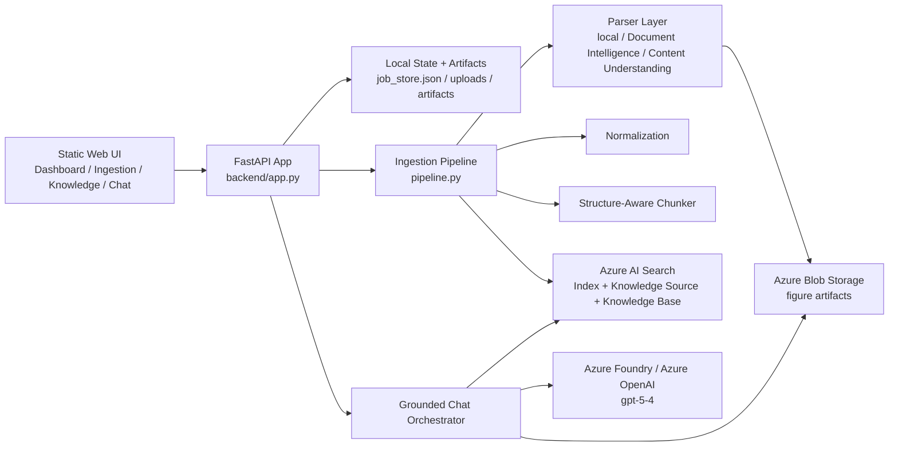
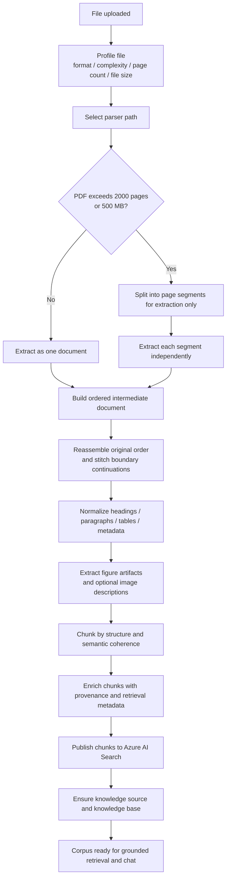
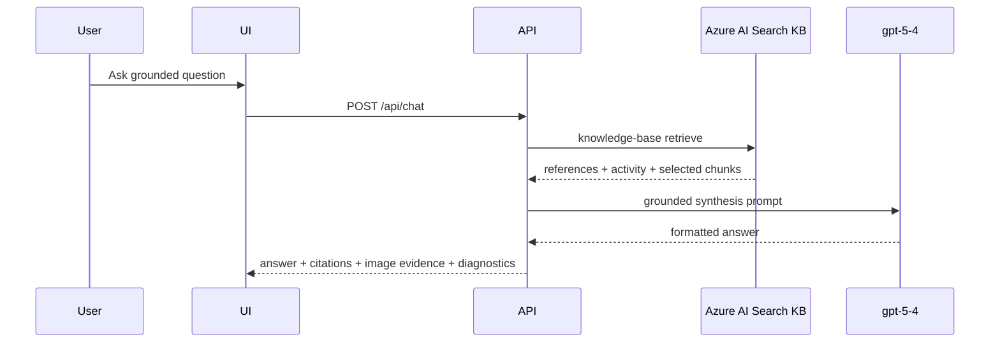

# Enterprise Knowledge Ingestion

Production-minded FastAPI application for enterprise document ingestion, large-file breakdown, structure-aware chunking, Azure AI Search knowledge publishing, and grounded chat with `gpt-5.4`.

The core design rule is simple: **the file is not the indexed unit**. A document first goes through profiling, parser selection, optional extractor-side segmentation, document reassembly, normalization, figure extraction, and structure-aware chunking. Only the resulting retrieval-ready chunks are published to Search.

## Quick Navigation

- [Platform Context](#platform-context)
- [What The App Does](#what-the-app-does)
- [Prerequisites](#prerequisites)
- [What You Need To Deploy](#what-you-need-to-deploy)
- [Deployment Setup](#deployment-setup)
- [Running The App](#running-the-app)
- [Current Architecture](#current-architecture)
- [Ingestion To Indexing Journey](#ingestion-to-indexing-journey)
- [Configuration](#configuration)
- [Current Chat Behavior](#current-chat-behavior)
- [Known Limits](#known-limits)
- [Validation](#validation)

## Platform Context

### What is Azure AI Search?

Azure AI Search is Azure's retrieval system for text, vector, hybrid, and multimodal search workloads. Microsoft positions it as the indexing and retrieval layer for both classic search and modern RAG or agentic retrieval applications. In this repo, Azure AI Search is the system of record for searchable chunks, knowledge sources, and the knowledge base queried by chat.

### What is Foundry IQ?

Foundry IQ is Microsoft Foundry's managed knowledge-base experience. Microsoft describes agentic retrieval as the multi-query retrieval engine that powers Foundry IQ knowledge bases, and notes that custom applications can use the same knowledge-base APIs through Azure AI Search. This repo uses Azure AI Search directly as the programmable path behind the same retrieval model that powers Foundry IQ.

### How this repo uses them together

This app prepares documents locally, publishes retrieval-ready chunks into Azure AI Search, creates knowledge sources and a knowledge base, and then calls the knowledge-base retrieval path from chat. A Foundry model deployment is used for grounded answer synthesis, figure understanding, and optionally for Search-side query planning in preview agentic flows.

## What The App Does

- Uploads local documents through a web UI.
- Profiles each file before parsing by inspecting type, size, page count, and rough complexity.
- Routes the file to the appropriate parser path.
- Splits oversized PDFs before Azure Document Intelligence analysis when page-count or file-size limits are exceeded.
- Reassembles extracted segment outputs into one logical document view.
- Preserves sections, page ranges, tables, figures, and metadata in an intermediate JSON model.
- Extracts embedded PDF figures and can describe them with `gpt-5.4`.
- Stores figure artifacts locally and attempts Blob upload when configured.
- Chunks content by structure instead of flattening whole documents.
- Publishes chunks into Azure AI Search index, knowledge source, and knowledge base.
- Can route grounded retrieval across multiple Azure AI Search knowledge sources and indexes.
- Lets the operator delete corpora and re-sync them without rebuilding the whole repo state.
- Uses Azure AI Search knowledge-base retrieval as the grounded retrieval layer.
- Uses deployed `gpt-5.4` to synthesize final answers from retrieved evidence.
- Shows citations, image evidence, and agentic retrieval activity in the chat UI.
- Supports auto corpus routing and custom corpus selection in chat.
- Links inline answer references like `[1]` to grouped evidence cards in the side panel.

## Prerequisites

### Local prerequisites

- Python with `pip`
- PowerShell for the included provisioning and run scripts
- Azure CLI with an authenticated session
- An Azure subscription that can create Search, Storage, AI Services, and Document Intelligence resources

### Azure prerequisites

- An Azure AI Search service
- A Microsoft Foundry or Azure AI Services resource for model deployments
- An Azure AI Document Intelligence resource
- An Azure Storage account and blob container for figure artifacts
- A Foundry project if you want to manage model deployments and Foundry-connected workflows from the portal

Optional:

- Content Understanding, if your target environment supports it and you want to test that parser path
- Extra Azure AI Search indexes and knowledge sources if you want true multi-index routing

Microsoft's current guidance describes Azure AI Search knowledge bases and knowledge sources as the programmable surface for agentic retrieval, with knowledge sources pointing at one or more searchable content stores and knowledge bases orchestrating retrieval behavior. Azure AI Search also recommends managed identity and RBAC for service-to-service authentication where possible.

## What You Need To Deploy

For the minimum working path in this repo, deploy:

1. Azure AI Search
2. Azure AI Document Intelligence
3. Microsoft Foundry or Azure AI Services resource
4. Azure Storage account with a blob container

For the richer path demonstrated in this repo, also deploy:

1. A Foundry project
2. A chat model deployment for final synthesis
3. A Search planning model deployment if you want Azure AI Search preview query planning with an attached LLM
4. Additional Search indexes if you want separate corpus lanes instead of one shared index

Azure AI Search knowledge bases can reference one or more knowledge sources, and each knowledge source can encapsulate a search index or certain remote sources. The stable `2026-04-01` programmatic surface is generally available, while some fuller agentic features remain on preview flows documented under `2025-11-01-preview`.

## Deployment Setup

### 1. Provision Azure resources

This repo includes [scripts/provision-azure.ps1](scripts/provision-azure.ps1) to create the baseline Azure resources:

- resource group
- storage account and blob container
- Azure AI Search service
- Azure AI Document Intelligence resource
- Foundry or AI Services resource
- optional Foundry project

Example:

```powershell
Set-ExecutionPolicy -Scope Process Bypass
.\scripts\provision-azure.ps1 `
  -SubscriptionId "<your-subscription-id>" `
  -Location "eastus" `
  -ResourceGroupName "rg-enterprise-knowledge-demo" `
  -CreateFoundryProject
```

### 2. Deploy the models you want to use

This repo expects:

- one chat model deployment for grounded answer synthesis
- optionally one planning model deployment for Azure AI Search agentic query planning
- optionally one embedding deployment if you extend the indexing path further

The current app supports using a Search-attached LLM deployment for agentic planning and a separate Foundry deployment for final answer synthesis. Microsoft documents that knowledge bases can include an optional LLM, and their agentic quickstart uses an Azure OpenAI model from Foundry Models for conversational retrieval.

### 3. Configure the app

Copy [.env.example](.env.example) to `.env`, then populate:

- Search endpoint, keys, index name, knowledge source name, and knowledge base name
- Document Intelligence endpoint and key
- Foundry endpoint and chat deployment name
- optional Search planning model settings
- optional Blob storage settings
- optional figure-image normalization limits for large embedded PDF images
- optional extra knowledge-source JSON for multi-index routing

### 4. Let the app create Search-side retrieval objects

After the Azure services are configured, the app creates or updates:

- the Search index used for chunk storage
- the Search knowledge source
- the Search knowledge base

This is why the provisioning script stops at service creation and does not try to hardcode your final corpus objects.

## Running The App

### Installation

```powershell
python -m venv .venv
.\.venv\Scripts\Activate.ps1
pip install -r requirements.txt
```

```powershell
pwsh -ExecutionPolicy Bypass -File .\scripts\start-local-app-background.ps1 -Port 8012
```

### Local run

```powershell
uvicorn backend.app:app --reload
```

Or use the included launcher scripts:

```powershell
.\scripts\run-local-app.ps1
```

Open [http://127.0.0.1:8000/](http://127.0.0.1:8000/).

### End-to-end startup checklist

1. Authenticate to Azure with `az login`
2. Provision the required Azure resources
3. Copy `.env.example` to `.env`
4. Fill in the Azure values emitted by provisioning
5. Install Python dependencies
6. Start the app
7. Upload a file or generate a sample corpus
8. Wait for the corpus to become ready
9. Open Chat and test grounded retrieval

### Current endpoints

- App: [http://127.0.0.1:8000/](http://127.0.0.1:8000/)
- Health: [http://127.0.0.1:8000/api/health](http://127.0.0.1:8000/api/health)
- Config: [http://127.0.0.1:8000/api/config](http://127.0.0.1:8000/api/config)
- Dashboard: [http://127.0.0.1:8000/api/dashboard](http://127.0.0.1:8000/api/dashboard)
- Documents: [http://127.0.0.1:8000/api/documents](http://127.0.0.1:8000/api/documents)
- Knowledge status: [http://127.0.0.1:8000/api/knowledge/status](http://127.0.0.1:8000/api/knowledge/status)

## Current Architecture



## Main Components

### Frontend

- `frontend/static/index.html`
- `frontend/static/app.js`
- `frontend/static/styles.css`

The UI includes:

- Dashboard
- Ingestion screen with sample generators
- Knowledge-base status
- Corpus management actions including delete
- Chat screen with user and agent bubbles
- Auto mode and custom corpus selection
- Citation cards
- Image evidence cards
- Evidence grouped by knowledge source and index
- Agentic retrieval activity panel
- Debug toggle

### Backend

- `backend/app.py`

Exposes upload, sample generation, status, retry, sync, chat, and figure artifact endpoints.

### Ingestion pipeline

- `backend/services/pipeline.py`

Pipeline responsibilities:

- profile the document
- choose the parser path
- decide whether extractor-side segmentation is required
- parse one file or many segments
- rebuild a unified intermediate document
- normalize and preserve figures
- create retrieval chunks
- enrich metadata
- persist artifacts
- publish to Search
- mark document ready for chat

### Parser selection and split logic

- `backend/services/parsers.py`
- `backend/core/config.py`

This is where the current selection logic lives.

The important distinction is:

- **parsing boundary**: a temporary extraction batch used to stay inside service limits
- **indexing boundary**: the final chunk emitted after the document has been reassembled and normalized

The parser layer is responsible for the first boundary. The chunker is responsible for the second one.

The active split rule is:

```text
if file is PDF and (
    page_count > HARD_PAGE_SPLIT_THRESHOLD
    or file_size > HARD_FILE_SPLIT_THRESHOLD_MB
):
    split into page-based segments
```

Current default thresholds:

- `HARD_PAGE_SPLIT_THRESHOLD=2000`
- `HARD_FILE_SPLIT_THRESHOLD_MB=500`
- `MAX_PAGES_PER_SEGMENT=250`

Current parser-routing intent:

- simple digital text documents -> local text-oriented parsing
- structure-heavy PDFs -> Azure Document Intelligence
- scanned or image-heavy documents -> OCR or layout-aware extraction
- Content Understanding -> optional alternate parser when configured
- oversized PDFs -> page-based extraction segments before Document Intelligence analysis

Notes:

- split decisions are made in `AzureDocumentIntelligenceParser.parse(...)`
- parser warnings are created in `ParserSelection.profile(...)`
- the pipeline calls parser detection and parse execution, but does not define the split rules itself

### Chunking

- `backend/services/chunking.py`

The chunker is structure-aware. It keeps:

- section path
- page numbers
- source metadata
- checksum
- tags
- chunk text

### Search publishing

- `backend/services/indexing.py`

The publishing adapter creates or updates:

- Azure AI Search index
- knowledge source
- knowledge base

and uploads chunk records with merge-or-upload semantics.

The scalable routing pattern is:

- one Azure AI Search index per corpus lane
- one knowledge source per index
- one knowledge base that can query one or more knowledge sources per request

This lets the app grow from one corpus lane to several without changing the chat contract.

### Grounded chat

- `backend/services/chat.py`
- `backend/services/foundry_openai.py`

The current chat path is:

1. retrieve grounded references from Azure AI Search knowledge base
2. derive visible subqueries and positive retrieval sources from Search activity
3. hydrate citations and figure evidence
4. supplement missing evidence when Search planned across multiple sources but returned unbalanced citations
5. send grounded evidence pack to deployed `gpt-5.4`
6. render answer, clickable references, grouped evidence cards, image evidence, and retrieval diagnostics in the UI

## Ingestion To Indexing Journey

This app treats document processing as a retrieval-quality pipeline, not as a raw file-upload step.

There are three separate layers in the journey:

1. **Extraction layer**: get content out of the source file, even if the file must be split into temporary batches first.
2. **Document layer**: rebuild one coherent document view with stable ordering, headings, figures, and metadata.
3. **Retrieval layer**: create retrieval-friendly chunks from the unified document and publish them to Search.

For large PDFs, segmentation is used only to stay within extractor limits. The final indexed unit is created after the document is reassembled, boundary-stitched, normalized, and chunked.

```text
segment for extraction only
reassemble into one ordered document view
stitch boundary continuations
normalize
chunk semantically
index
```



### 1. Upload and profile

When a file is submitted, the pipeline first profiles it before any parsing call is made.

The profile decides:

- file format
- complexity class
- page count if available
- file size
- parser path
- oversize warnings
- whether the file can be extracted as one unit or should be segmented first

This happens in:

- `backend/services/parsers.py`
- `backend/core/config.py`

### 2. Decide whether segmentation is required

Oversized PDFs are segmented before Azure Document Intelligence analysis when either condition is true:

- `page_count > HARD_PAGE_SPLIT_THRESHOLD`
- `file_size > HARD_FILE_SPLIT_THRESHOLD_MB`

Current defaults:

- `HARD_PAGE_SPLIT_THRESHOLD=2000`
- `HARD_FILE_SPLIT_THRESHOLD_MB=500`
- `MAX_PAGES_PER_SEGMENT=250`

Important rule:

- segmentation exists to satisfy extractor limits and throughput constraints
- segmentation should **not** define the final retrieval chunk boundaries
- segment size is a parser concern; semantic chunk size is a retrieval concern

### 3. Extract each segment independently

Once the file is segmented, each PDF segment is analyzed independently by the selected parser.

Current parser options:

- local simple parser for text-like content
- Azure Document Intelligence for structure-heavy PDFs
- Azure Content Understanding when configured
- fallback PDF and Office stubs when Azure parsing is unavailable

This is where the pipeline gets raw paragraphs, layout-derived text, and figure artifacts.

For large files, this stage is allowed to be mechanically batch-oriented. The next stages are where coherence is restored.

### 4. Reassemble segments into one logical document

After segmented extraction, the parser restores the original segment order, preserves rebased page provenance at the paragraph or section level, and rebuilds one unified intermediate document. Segment boundaries remain temporary extraction seams and are not treated as final indexing boundaries.

### 5. Stitch boundary continuations

Before chunking, the pipeline runs a boundary-stitch pass across adjacent segment outputs.

The stitch pass checks for:

- sentence continuations split across segment boundaries
- paragraph fragments cut by the segment seam
- repeated overlap text if segment overlap is introduced
- continued tables whose header or row pattern resumes in the next segment
- section heading carry-forward when segment B begins inside the same logical section as segment A
- repeated headers and footers introduced by page or batch boundaries

The implementation uses deterministic seam-repair heuristics first. When a boundary is still ambiguous and a Foundry chat deployment is available, the pipeline can ask `gpt-5.4` whether two adjacent fragments belong to the same paragraph and, if so, merge them conservatively. The stitch pass records summary statistics in document metadata.

### 6. Normalize the unified document

After reassembly and stitching, normalization operates on the unified document view rather than on isolated segment payloads.

Normalization is responsible for:

- whitespace cleanup
- heading cleanup
- paragraph cleanup
- preserving section hierarchy
- preserving tables
- preserving metadata

The normalization stage lives in:

- `backend/services/normalization.py`

### 7. Build the intermediate document model

All parser output is converted into one `IntermediateDocument` before final chunking.

That model preserves:

- `doc_id`
- `source_name`
- `source_path`
- `parser_path`
- `page_count`
- `sections`
- `warnings`
- `metadata`

For PDFs, metadata can also include:

- segmentation strategy
- segment count
- segment page ranges
- segmentation triggers
- chosen segment size
- figure artifacts
- image descriptions

### 8. Extract and preserve figures

For PDFs, embedded images are extracted as figure artifacts.

For each figure, the pipeline can store:

- `artifact_id`
- `page_number`
- `artifact_path`
- normalized image metadata such as resized dimensions and output format
- Blob metadata if upload succeeds
- `gpt-5.4` image description when enabled

Figure preservation matters because some questions are answered better from diagrams, plans, tables, and callouts than from narrative text alone.

Embedded TIFF or oversized PDF figures are normalized to PNG and downscaled when needed so large image artifacts do not fail ingestion or downstream image understanding.

### 9. Chunk from the unified document, not from raw batches

Final retrieval chunking should happen after reassembly and normalization.

The chunker optimizes for:

- section coherence
- sentence coherence
- table integrity
- breadcrumb preservation
- overlap where needed
- provenance back to the original document pages

Each chunk is expected to preserve:

- one chunk should represent one coherent unit of meaning
- one chunk should not exist only because the extractor had to split the source file
- chunk overlap should be intentional and retrieval-driven, not an accidental byproduct of parser batching

Each chunk should carry:

- `chunk_id`
- `doc_id`
- `source_name`
- `source_uri`
- `page_numbers`
- `section_path`
- `content_type`
- `tags`
- `checksum`
- `last_updated`
- `clean_text`
- `image_evidence_json`

### 10. Publish to Azure AI Search

Once the chunks are ready, the publishing adapter:

1. ensures the Search index exists
2. uploads chunk records
3. ensures the knowledge source exists
4. ensures the knowledge base exists

At this point, the indexed unit is a coherent retrieval chunk rather than a raw extraction segment.

### 11. Retrieve and answer

The model does not answer from the raw document directly.

The live chat path is:



## Implementation Summary

The current application includes:

- document profiling and parser routing
- page-count and file-size split decisions for oversized PDFs
- per-segment Azure Document Intelligence extraction
- paragraph-level page rebasing for segmented parser output
- segment-boundary stitching with deterministic repair and optional `gpt-5.4` disambiguation
- normalized intermediate JSON persistence
- structure-aware chunking
- Azure AI Search index, knowledge source, and knowledge base publishing
- multi-index retrieval routing
- grounded answer synthesis with `gpt-5.4`

## Sample Corpora

The app currently includes sample generators for:

- random research corpus
- generative AI futures report
- construction industry report

Generated PDFs, extracted figures, chunk artifacts, and local job state are runtime outputs. They are not meant to be committed to source control; the repo now ignores those paths so each deployment can generate its own corpora on demand.

### 1. Random research corpus

Endpoint:

- `POST /api/samples/random-research-corpus`

Purpose:

- exceed the hard page split threshold
- force page segmentation with meaningful content instead of synthetic filler
- pick a researched topic pack and expand it into a long-form corpus
- test large-document orchestration against a document that still supports realistic grounded questions

Current topic pool:

- power-system transformation and grid modernization
- future of generative AI
- construction industry and knowledge architecture

### 2. Generative AI futures report

Endpoint:

- `POST /api/samples/generative-ai-futures-report`

Purpose:

- generate a 500+ page research-style corpus
- embed section diagrams
- exercise large-document parsing, figure extraction, and grounded chat

### 3. Construction blueprint report

Endpoint:

- `POST /api/samples/construction-industry-report`

Purpose:

- generate a 500+ page construction-focused corpus
- include CAD-like blueprint visuals
- include a construction knowledge-architecture sheet
- enable richer diagram-grounded questions in chat

Sample file names now include a random suffix so repeated generation does not overwrite the source file referenced by older jobs.

## Blueprint-Style Construction Diagrams

The construction corpus now includes more technical visual sheets instead of only infographic-style charts.

Examples:

- CAD-like floor-plan sheet for BIM and digital twin context
- CAD-like architecture sheet for construction knowledge retrieval
- grid lines
- dimension strings
- room or component labels
- callout bubbles
- sheet identifiers

These are meant to support prompts such as:

- “Show me the construction knowledge architecture diagram and explain each stage.”
- “What does the BIM / digital twin blueprint imply about lifecycle evidence and retrieval?”
- “Which callouts in the architecture sheet correspond to chunking, citations, and image evidence?”

## Configuration

Copy `.env.example` to `.env` and populate the values you need.

### Core

- `CHUNK_SIZE_TOKENS`
- `CHUNK_OVERLAP_TOKENS`
- `MAX_PAGES_PER_SEGMENT`
- `LARGE_DOCUMENT_PAGE_THRESHOLD`
- `HARD_PAGE_SPLIT_THRESHOLD`
- `HARD_FILE_SPLIT_THRESHOLD_MB`
- `ENABLE_LLM_BOUNDARY_STITCHING`
- `REQUEST_TIMEOUT_SECONDS`

### Parsing

- `AZURE_DOCUMENT_INTELLIGENCE_ENDPOINT`
- `AZURE_DOCUMENT_INTELLIGENCE_KEY`
- `AZURE_DOCUMENT_INTELLIGENCE_MODEL`
- `AZURE_CONTENT_UNDERSTANDING_ENDPOINT`
- `AZURE_CONTENT_UNDERSTANDING_KEY`
- `AZURE_CONTENT_UNDERSTANDING_ANALYZER_ID`

### Search and knowledge publishing

- `AZURE_SEARCH_ENDPOINT`
- `AZURE_SEARCH_KEY`
- `AZURE_SEARCH_QUERY_KEY`
- `AZURE_SEARCH_INDEX_NAME`
- `AZURE_SEARCH_KNOWLEDGE_SOURCE_NAME`
- `AZURE_SEARCH_KNOWLEDGE_BASE_NAME`
- `AZURE_SEARCH_API_VERSION`
- `AZURE_SEARCH_EXTRA_SOURCES_JSON`
- `AZURE_SEARCH_AUTO_BROADCAST_LIMIT`
- `AZURE_SEARCH_LLM_DEPLOYMENT`
- `AZURE_SEARCH_LLM_MODEL_NAME`
- `AZURE_SEARCH_LLM_REASONING_EFFORT`
- `AZURE_SEARCH_LLM_USE_MANAGED_IDENTITY`

If you enable a knowledge-base LLM for Search planning, Microsoft's current guidance says the search service needs a managed identity and appropriate permissions on the Foundry resource when role-based authentication is used.

### Grounded GPT synthesis

- `AZURE_FOUNDRY_RESOURCE_ENDPOINT`
- `AZURE_FOUNDRY_CHAT_DEPLOYMENT`
- `AZURE_FOUNDRY_PROJECT_ENDPOINT`
- `FOUNDRY_CHAT_MODE`

### Figure artifact storage

- `AZURE_STORAGE_ACCOUNT`
- `AZURE_STORAGE_ACCOUNT_KEY`
- `AZURE_STORAGE_CONTAINER`
- `ENABLE_IMAGE_UNDERSTANDING`

## Current Chat Behavior

The chat screen now supports:

- user and agent message bubbles
- rendered markdown output
- auto corpus routing and custom corpus selection
- citation cards
- grouped evidence cards by knowledge source and index
- clickable inline references that jump to evidence cards
- inline image evidence for matched figures
- agentic retrieval activity panel
- raw diagnostics panel

The evidence panel also summarizes:

- which retrieval sources returned positive hits
- which sources are represented in the final evidence cards
- whether any positive retrieval source is still missing visible evidence

One practical nuance: Azure AI Search agentic retrieval may perform reasoning without always returning multiple visible search steps in the response payload. The UI now distinguishes between:

- visible search steps
- reasoning detected
- no exposed decomposed search steps

## Known Limits

- Persistence is still local JSON plus local artifact files, not a production database.
- The frontend is a static SPA, not a compiled React app.
- Blob upload is best-effort. If Blob data-plane upload fails, figure artifacts remain available from local storage.
- Content Understanding is optional and only active when fully configured.
- Search retrieval is the primary grounded retrieval plane; Foundry Agent Service is not the active chat path.
- The fallback PDF parser is intentionally limited compared with Azure Document Intelligence.
- `large_document_page_threshold` exists in config but is not the hard split trigger; the live split triggers are page count and file size.

## Validation

Run:

```powershell
python -m compileall backend tests
python -m unittest discover -s tests
```
